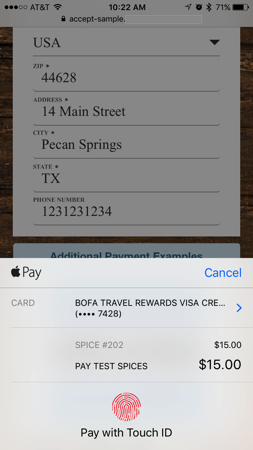

# Accept Sample Application
The Accept sample application provides examples of how to use the Authorize.Net Accept suite of tools to integrate secure payment acceptance into your applications.

## How to Use the Sample App

+ Clone or download this repository.

+ Host the sample app in any web server supporting PHP, for example IIS or XAMPP (Apache). __HTTPS (SSL) must be enabled for your website.__

+ Set the authentication credentials in the application so that it uses your Authorize.Net sandbox (test) account. If you haven't yet signed up for a sandbox account, you can create a sandbox account at our [Developer Center] (https://developer.authorize.net/hello_world/sandbox/). Set environment variables for `API_LOGIN_ID` and `TRANSACTION_KEY` using the credentials for your Authorize.Net sandbox account. For example, in _httpd.conf_, you would add the following lines:

        SetEnv API_LOGIN_ID your_id
        SetEnv TRANSACTION_KEY your_key  

  For IIS, you could set these environment variables in FastCGI Settings -> Environment Variables.

+ Set the authentication credentials that Accept.js uses. Edit the `acceptJSCaller()` function in _acceptJSCaller.js_ to use your API login ID and public client key for the values of `authData.apiLoginID` and `authData.clientKey`. A public client key can be created by logging into the [Merchant Interface](https://sandbox.authorize.net/) and navigating to __Account --> Security Settings --> Manage Public Client Key__.

+ Browse the application (_index.php_) over HTTPS connection.

+ To "log in", use a customer profile ID that already exists within your account or create a new one by using the [Create a Customer Profile API](http://developer.authorize.net/api/reference/index.html#customer-profiles-create-customer-profile).

+ In these examples, payment forms are shown in the same page and Shipping forms are handled in a separate modal popup. However, any of the types of display can be chosen to display any type of form.

### Common issues during installation
1.    **Error**: *Uncaught Error: Class 'SimpleXMLElement' not found in accept-sample-app/getToken.php:24*

  **Possible methods to resolve**
     + Install simplexml package for your OS. Refer: http://stackoverflow.com/questions/35593521/php-7-simplexml

  **Related issue**
     + https://github.com/AuthorizeNet/accept-sample-app/issues/25

## Included Examples

### Accept Customer
Accept Customer is the new name for Hosted CIM, part of our Customer Profiles API. See our [developer documentation](http://developer.authorize.net/api/reference/features/customer_profiles.html) for more details.

The sample application shows how to:  

* Incorporate the Manage Customer hosted page into your application ("Profile" tab).
* Embed the hosted "Add/Edit Payment" page into your application as an iframe ("Payment Methods" tab).  
* Pop up the hosted "Add/Edit Shipping" page in a light-box mode ("Shipping" tab).  

### Accept.js
Accept.js is a new integration option which allows you to leverage the full power of the Authorize.Net API while avoiding the PCI compliance burden of credit card information hitting your servers. See our [developer documentation](http://developer.authorize.net/api/reference/features/acceptjs.html) for more details.  

The sample application shows how to:  

* Incorporate the Accept.js library into your existing payment flow ("Pay" tab --> "Pay (Accept.js)" button)  

### Accept Hosted
Accept Hosted provides a fully hosted payment transaction solution. Authorize.Net takes care of the payment form, the transaction itself, and the receipt generation (optional).  We have a Step-by-Step guide to the sample implementation here: [README-AcceptHosted.md](README-AcceptHosted.md). See our [developer documentation](http://developer.authorize.net/api/reference/features/accept_hosted.html) for more details.

The sample application shows how to:  

*  Request an Accept Hosted form token using the Authorize.Net API (GetHostedPaymentForm).  
*  Incorporate the Accept Hosted payment form into your existing payment flow ("Pay" tab).  
*  Display a custom receipt using the transaction response.  

### Apple Pay On The Web
Authorize.Net supports Apple Pay on the Web in addition to our in-app Apple Pay Support. See our [developer documentation](http://developer.authorize.net/api/reference/features/in-app.html) for more details.   

In this sample we demonstrate how to:  

* Integrate with the ApplePay.js library.  
* Validate your merchant identity from your server.  
* Complete the transaction by passing the Apple Pay payment data in the Authorize.Net `createTransactionRequest` API call.  

Please note that you will need to have a merchant ID set up with Apple as described in their [Apple Pay documentation](https://developer.apple.com/reference/applepayjs/).
